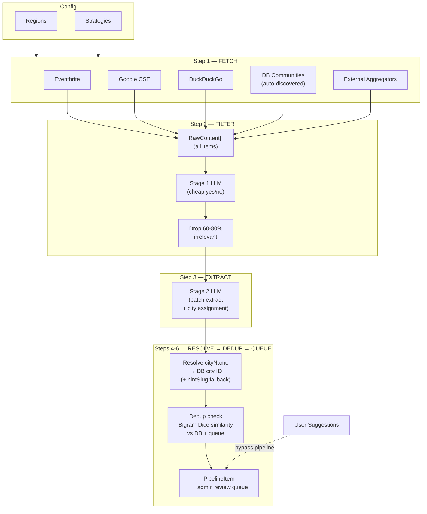
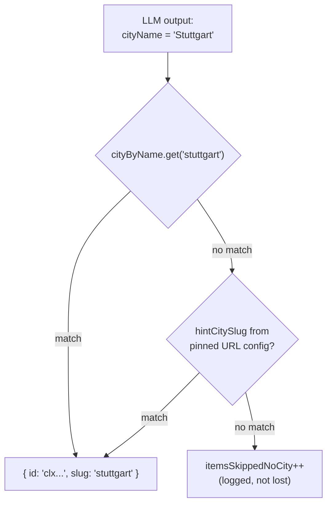
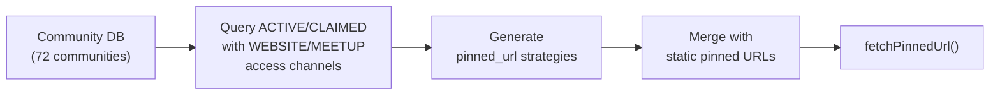

# LocalPulse AI Content Agent — Technical Architecture

## Module Structure

```
src/modules/pipeline/
├── types.ts          # All types — SourceType, SearchStrategy, SearchRegion, ExtractedData, etc.
├── config.ts         # Region + strategy config, DIASPORA_KEYWORDS, helper functions
├── db-sources.ts     # DB-driven source generation — reads community access channels from DB
├── sources.ts        # Source adapters — fetchEventbriteKeywords, fetchPinnedUrl, fetchGoogleSearch, fetchDuckDuckGoSearch
├── extraction.ts     # Two-stage LLM — filterRelevance (Stage 1), extractBatch (Stage 2)
├── orchestrator.ts   # Pipeline brain — coordinates fetch → filter → extract → dedup → queue
├── run.ts            # CLI entry point (npx tsx src/modules/pipeline/run.ts)
├── index.ts          # Public exports
└── __tests__/
    └── orchestrator.test.ts   # computeSimilarity unit tests

src/app/admin/pipeline/
├── page.tsx              # Admin review queue UI
├── actions.ts            # Server actions — approve, reject, batch approve, trigger pipeline
└── RunPipelineButton.tsx # Client component — "Run Pipeline Now" button with live results
```

## Pipeline Flow



## Core Design Decisions

### 1. Generic-First (Search Broad, Filter with AI)

Previous design: every source was hardcoded to a city. Adding Stuttgart meant configuring 10 sources manually for Stuttgart.

Current design: strategies define WHAT to search (keywords, APIs), regions define WHERE. They combine at runtime. The LLM assigns the city from content.

```typescript
// Config — strategies × regions = automatic combination
SearchStrategy { id, sourceType, kind: 'keyword_search' | 'pinned_url', ... }
SearchRegion   { id, searchCenter, citySlugs[], enabled }

// Runtime — orchestrator loops:
for region of enabledRegions:
  for strategy of keywordStrategies:
    fetch(strategy, region)  // e.g. Eventbrite × Baden-Württemberg
```

Adding a country = 1 region entry + city DB records. No code changes.

### 2. Two-Stage LLM

**Stage 1: Relevance Filter** (`filterRelevance`)

- Model: gpt-4o-mini
- Batch size: 10 items per call
- Input: 500 chars per item (just enough for relevance)
- Output: `{index, isRelevant, reason}` per item
- Cost: ~$0.001 per batch
- Purpose: Drop noise (Indian restaurants, "Indiana Jones" events)
- Fallback: On LLM failure, marks all as relevant (safe — humans review later)

**Stage 2: Structured Extraction** (`extractBatch`)

- Model: gpt-4o-mini (configurable via `PIPELINE_LLM_MODEL`)
- Batch size: 5 items per call
- Input: 3000 chars per item
- Output: Structured `ExtractedEvent` or `ExtractedCommunity` with `cityName`
- Cost: ~$0.005-0.01 per batch
- Outputs `confidence` (0-1) and per-field `fieldConfidence`

**Why two stages?** Eventbrite search for "Indian" returns ~100 results, 70-80% irrelevant. Sending all through full extraction = 20× the tokens. Stage 1 costs 1/10th of Stage 2.

### 3. Batch Processing

System prompt tokens are the expensive part of LLM calls. Batching amortises them:

| Approach         | Items | LLM Calls | System Prompt Tokens | Total   |
| ---------------- | ----- | --------- | -------------------- | ------- |
| One-at-a-time    | 50    | 50        | 50 × 800 = 40,000    | ~60,000 |
| Batched (5/call) | 50    | 10        | 10 × 800 = 8,000     | ~28,000 |

**53% token savings** from batching alone.

### 4. City Assignment by LLM

The LLM extracts `cityName` from content (venue address, page text, event location). The orchestrator resolves it:



## Source Adapters (`sources.ts`)

### `fetchEventbriteKeywords(strategy, region)`

- Iterates strategy.keywords × region.searchCenter
- Uses Eventbrite `/v3/events/search/` API with location radius
- Returns structured `RawContent[]` with venue, description, dates
- Deduplicates by `sourceUrl` (same event from multiple keyword hits)

### `fetchGoogleSearch(strategy, region)`

- Uses Google Custom Search API (`googleapis.com/customsearch/v1`)
- Combines each keyword with `region.searchCenter` for location context
- Returns title + snippet + OG description as `RawContent`
- Discovers WhatsApp-only groups mentioned on blogs, directories, university pages
- Free tier: 100 queries/day

### `fetchDuckDuckGoSearch(strategy, region)`

- Uses DuckDuckGo HTML lite endpoint — **no API key needed**
- Parses HTML search results page for links, titles, snippets
- 15 targeted keywords per region (e.g. "Indian community", "Tamil Sangam", "JITO chapter Jain")
- Rate-limited by DDG (pipeline adds delays between queries)
- Serves as the free fallback when Google CSE/Eventbrite keys aren't configured

### `fetchPinnedUrl(strategy)`

- Fetches a single known-high-value URL
- Facebook variant: uses mobile User-Agent, strips to `m.facebook.com`
- Generic variant: strips `<script>`, `<style>`, `<nav>`, `<footer>` tags
- Extracts up to 5 image URLs
- Caps text at 15K characters

## Extraction Module (`extraction.ts`)

### OpenAI Client

- Endpoint: `https://api.openai.com/v1/chat/completions`
- JSON mode: `response_format: { type: 'json_object' }`
- Temperature: 0.1 (deterministic extraction)
- Timeout: 60 seconds
- Token tracking: counts `prompt_tokens + completion_tokens` per call

### Relevance Filter Prompt

Tells the LLM to classify each item as relevant/not-relevant to Indian/South Asian diaspora. Explicitly includes community types:

- Cultural events, festivals (Diwali through Janma Kalyanak)
- Organisation types (Sangam, Sangh, JITO)
- WhatsApp-based groups
- Excludes: restaurants, incidental mentions

### Extraction Prompt

Extracts structured fields into `ExtractedEvent` or `ExtractedCommunity`:

- Events: title, date, time, venue, city, cost, registration URL, host community, categories, languages
- Communities: name, description, city, categories, languages, website/Facebook/Instagram/WhatsApp/Telegram/email
- Recognises organisation suffixes: Sangam, Sangh, Samaj, Mandal, Sabha, Verein, e.V.
- Both include `confidence` and `fieldConfidence` scores

### Normalizers

Raw LLM output is normalized through type-safe functions:

- `normalizeEvent()` / `normalizeCommunity()` — coerce all fields to expected types
- `normalizeConfidence()` — clamp to 0-1, default 0.5
- `normalizeFieldConfidence()` — per-field confidence map
- `normalizeStringArray()` — filters non-string elements

## Orchestrator (`orchestrator.ts`)

### Run Flow

```typescript
async function runPipeline(): Promise<PipelineRunResult>;
```

1. **Fetch** — Loops keyword strategies × regions, dispatching to `fetchEventbriteKeywords`, `fetchGoogleSearch`, or `fetchDuckDuckGoSearch` based on `sourceType`. Then merges static pinned URLs (external aggregators) with DB-driven community sources (`getDbCommunityStrategies()`). Tags pinned URL items with `_hintCitySlug`.

2. **URL Dedup** — `Set<sourceUrl>` removes duplicates from overlapping keyword searches.

3. **Stage 1 Filter** — `filterRelevance(uniqueRaw)` → keeps only `isRelevant: true` items.

4. **Stage 2 Extract** — `extractBatch(relevantItems)` → structured `ExtractedData[]` with `sourceIndex` back-reference.

5. **City Resolution** — Pre-loads all cities from DB. Resolves `cityName` → `cityId` via case-insensitive name lookup. Falls back to `_hintCitySlug`. Logs and skips items with no match.

6. **Dedup Check** — Three layers:
   - Exact `sourceUrl` match in pending/approved queue → skip
   - Event: same date + title similarity > 0.7 (Dice coefficient on bigrams) → flag
   - Community: name similarity > 0.7 → flag
   - High-confidence dupes (> 0.9) auto-skip, borderline dupes attach `matchScore` for admin review

7. **Queue** — Creates `PipelineItem` in PostgreSQL with extracted data, confidence, city, match info.

### Deduplication: `computeSimilarity()`

Bigram Dice coefficient. Fast, no dependencies, good enough for near-duplicate detection:

```
similarity = (2 × |bigrams(a) ∩ bigrams(b)|) / (|bigrams(a)| + |bigrams(b)|)
```

Threshold: 0.7 for flagging, 0.9 for auto-skip.

## Database Model

```prisma
model PipelineItem {
  id              String              @id @default(cuid())
  entityType      PipelineEntityType  // EVENT | COMMUNITY
  status          PipelineItemStatus  // PENDING | APPROVED | REJECTED | MERGED
  sourceType      PipelineSourceType  // EVENTBRITE | FACEBOOK | GOOGLE_SEARCH | COMMUNITY_SUGGESTION | ...
  sourceUrl       String?
  rawContent      String?             // original text (audit trail)
  extractedData   Json                // structured ExtractedEvent or ExtractedCommunity
  confidence      Float
  cityId          String
  matchedEntityId String?             // existing entity if dupe detected
  matchScore      Float?              // similarity score
  reviewedBy      String?
  reviewedAt      DateTime?
  reviewNotes     String?
  createdEntityId String?             // entity ID created on approval
}
```

Source types: `EVENTBRITE`, `FACEBOOK`, `INSTAGRAM`, `WEBSITE_SCRAPE`, `CGI_MUNICH`, `INDOEUROPEAN`, `GOOGLE_ALERT`, `GOOGLE_SEARCH`, `DUCKDUCKGO`, `MEETUP`, `COMMUNITY_SUGGESTION`, `DB_COMMUNITY`

## Community Suggestion Bridge

When a user submits via `/[city]/suggest`, the action (`reports.ts`) does two things:

1. Creates a `ContentReport` (existing behaviour — shows in admin reports)
2. Creates a `PipelineItem` with `sourceType: COMMUNITY_SUGGESTION` and `confidence: 0.6`

This means WhatsApp-only communities enter the structured pipeline with whatever the user provided (name, details, email). Admin reviews alongside AI-discovered content.

## DB-Driven Source Discovery (`db-sources.ts`)

Instead of hardcoding community website URLs in config, the pipeline **automatically reads community access channels from the database** at runtime.

### How It Works



`getDbCommunityStrategies()` queries the database for all ACTIVE or CLAIMED communities that have scrapeable access channels (WEBSITE, MEETUP), and generates a `SearchStrategy[]` of `pinned_url` entries with:

- `sourceType: 'DB_COMMUNITY'` — tracks provenance
- `hintCitySlug` from the community's city — always accurate
- `url` from the AccessChannel record

### Benefits

- **Zero maintenance** — new communities added via admin, submit form, or pipeline approval with a WEBSITE channel automatically become pipeline sources
- **Self-improving loop** — pipeline discovers community → admin approves → community gets WEBSITE channel → next pipeline run scrapes that website for events
- **No stale URLs in config** — if a community is marked INACTIVE, its website stops being scraped

## Configuration (`config.ts`)

### Keywords (65+)

Organised by category:

- Cultural identifiers: Indian, Bollywood, Desi, South Asian
- Organisation types: Sangam, Sangh, Samaj, Mandal, Mandir, Sabha, Verein, JITO
- Festivals: Diwali through Rath Yatra (20+ festivals including Jain and Sikh)
- Religious: Jain, Sikh, Gurdwara, Hindu Temple, Kovil
- Languages: Tamil through Kashmiri (15 languages)
- Activities: Cricket, Bhangra, Kathak, Bharatanatyam, etc.

### Regions

```typescript
{ id: 'baden-wuerttemberg', searchCenter: 'Stuttgart, Germany', citySlugs: ['stuttgart', 'karlsruhe', 'mannheim'] }
```

Expand by adding entries. Commented-out examples for Bavaria, Netherlands.

### Strategies

- **Eventbrite keyword search** — 58 keywords × 50km radius per region
- **Google CSE keyword search** — 16 targeted compound queries per region
- **DuckDuckGo keyword search** — 15 keywords per region (free, no API key)
- **9 static pinned URLs** — CGI Munich, IndoEuropean (5), Indians in Germany, AIGEV, DIZ BW
- **DB community sources** — auto-generated from community WEBSITE/MEETUP access channels (currently 7)

## Environment Variables

| Variable             | Required | Purpose                                     |
| -------------------- | -------- | ------------------------------------------- |
| `OPENAI_API_KEY`     | Yes      | LLM calls (filter + extraction)             |
| `DATABASE_URL`       | Yes      | PostgreSQL connection                       |
| `EVENTBRITE_API_KEY` | No       | Eventbrite event search                     |
| `GOOGLE_CSE_API_KEY` | No       | Google Custom Search                        |
| `GOOGLE_CSE_ID`      | No       | Google Custom Search engine ID              |
| `PIPELINE_LLM_MODEL` | No       | Override LLM model (default: `gpt-4o-mini`) |

## Running the Pipeline

### Admin UI (recommended)

The admin pipeline page at `/admin/pipeline` has a **"Run Pipeline Now"** button:

- Triggers the full pipeline via a server action
- Shows a spinner while in progress (~60s typical run)
- Displays a live results summary (sources processed, items queued, LLM usage, errors)
- Page auto-refreshes to show new pipeline items in the review queue

### CLI

```bash
# Full pipeline run
npx tsx src/modules/pipeline/run.ts

# Config preview only — shows regions, strategies, DB sources (no API calls)
npx tsx src/modules/pipeline/run.ts --dry-run
```

Output includes: regions scanned, items fetched/filtered/extracted/queued, duplicates skipped, LLM calls, token estimate, duration.

## Token Efficiency at Scale

Current (1 region, ~50 items):

- ~5 filter calls + ~3 extraction calls = 8 LLM calls
- ~4,000 tokens estimated

Europe scale (50 regions, ~2,500 items):

- ~250 filter calls + ~100 extraction calls = 350 LLM calls
- ~200,000 tokens estimated ≈ $30-60/month on gpt-4o-mini

Key savings:

- Two-stage design: 60-80% of items never reach expensive extraction
- Batching: 53% token reduction vs one-at-a-time
- URL dedup before LLM: same event from 5 keyword searches = 1 LLM call, not 5

## Error Handling

- **Source fetch failures**: Logged in `errors[]`, pipeline continues with other sources
- **LLM filter failure**: Falls back to marking all items as relevant (safe — humans review)
- **LLM extraction failure**: Returns empty array, error logged, pipeline continues
- **City not resolved**: Item logged and skipped (`itemsSkippedNoCity` metric)
- **API timeout**: 15s for sources, 60s for LLM calls
- **Token tracking**: All calls tracked, reported in run summary

## Testing

```bash
npx vitest run
```

- `orchestrator.test.ts`: 8 tests covering `computeSimilarity()` — identical strings, completely different strings, near-duplicates, cross-source duplicates, edge cases (empty/single-char)
- Integration tests: community queries (6 tests), scoring (25 tests), page rendering (5 tests)
- All 44 tests pass with 0 type errors
