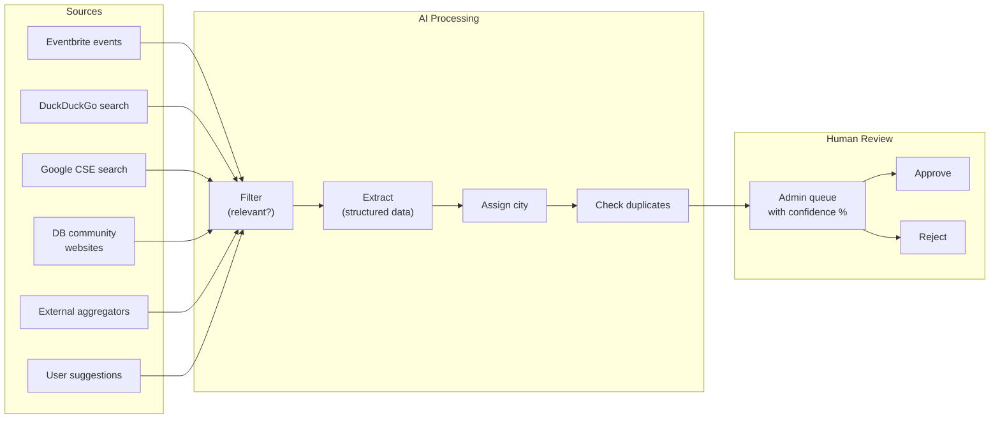

# LocalPulse AI Content Agent — Product Document

## What It Is

The AI Content Agent is an automated pipeline that discovers, validates, and queues Indian diaspora community content (events and communities) across European cities — replacing manual content curation.

It searches public sources, uses AI to filter and structure what it finds, and presents everything in an admin review queue. A human approves or rejects each item in one click.

## The Problem It Solves

| Without Agent                                                 | With Agent                                                          |
| ------------------------------------------------------------- | ------------------------------------------------------------------- |
| Admin manually checks 10+ websites weekly                     | Agent scans all sources in minutes                                  |
| New communities discovered by word-of-mouth only              | Google CSE finds scattered mentions of WhatsApp-only groups         |
| Adding a new city means setting up fresh manual workflows     | Add a region config entry — done                                    |
| Content goes stale between manual checks                      | Scheduled runs catch updates within days                            |
| WhatsApp-only groups (JITO, Jain Sangh, Maitri) are invisible | User suggestions auto-seed the pipeline + Google discovers mentions |

## How It Works (Non-Technical)

1. **Discover** — The agent searches Eventbrite, DuckDuckGo, Google, external aggregator websites, and community websites from the database using 65+ diaspora keywords.

2. **Filter** — AI makes a fast yes/no call: "Is this about the Indian diaspora?" Drops irrelevant results (Indian restaurants, coincidental mentions).

3. **Extract** — AI reads each relevant item and extracts structured fields: event title, date, venue, city, community name, WhatsApp link, categories, languages.

4. **Deduplicate** — Checks against existing database entries and the pending queue. Same event from two different sources? Caught automatically.

5. **Queue** — Items land in `/admin/pipeline` with a confidence score. Admin approves to publish or rejects with a note.

6. **Self-improving** — Approved communities with websites automatically become sources for future pipeline runs.

## What It Discovers

### Events

- Cultural festivals (Diwali, Holi, Pongal, Navratri, Janma Kalyanak)
- Community meetups and gatherings
- Student association events
- Religious celebrations
- Sports events (cricket tournaments, etc.)

### Communities

- Language-based groups (Tamil Sangam, Telugu Association, Bengali Maitri, Odia groups)
- Religious organisations (Jain Sangh, Sikh Gurdwara, Hindu temples)
- Professional networks (JITO chapters)
- Student associations
- WhatsApp-only groups with no web presence (discovered via Google mentions + user suggestions)

## Source Channels

| Source                    | What It Finds                                                                   | API Needed                             |
| ------------------------- | ------------------------------------------------------------------------------- | -------------------------------------- |
| **DuckDuckGo search**     | Free web search for diaspora keywords — no API key needed                       | None                                   |
| **DB community websites** | Auto-scraped from community WEBSITE/MEETUP access channels in the database      | None                                   |
| **Eventbrite**            | Public events with diaspora keywords                                            | `EVENTBRITE_API_KEY`                   |
| **Google Custom Search**  | Blog posts, directories, university pages mentioning diaspora groups            | `GOOGLE_CSE_API_KEY` + `GOOGLE_CSE_ID` |
| **External aggregators**  | CGI Munich events, IndoEuropean.eu (5 pages), Indians in Germany, AIGEV, DIZ BW | None                                   |
| **User suggestions**      | "Suggest a Community" form submissions auto-enter as pipeline items             | None                                   |

## Scaling Model

The agent is designed for all-Europe expansion with zero code changes.

**Adding a new country/region:**

1. Add one entry to the region config (name, center city, covered cities)
2. Add city records to the database
3. Done — all keyword strategies automatically run for the new region

**Current:** Baden-Württemberg (Stuttgart, Karlsruhe, Mannheim)

**Future examples:** Bavaria (Munich), NRW (Düsseldorf, Cologne), Netherlands (Amsterdam, Rotterdam), UK (London, Birmingham)

## Cost Model

| Component            | Cost                         | Notes                                                            |
| -------------------- | ---------------------------- | ---------------------------------------------------------------- |
| OpenAI (gpt-4o-mini) | ~$2-5/month at current scale | Two-stage design: cheap filter saves 60-80% of extraction tokens |
| DuckDuckGo           | Free                         | HTML scraping, no API key                                        |
| Eventbrite API       | Free tier                    | 1000 calls/day                                                   |
| Google CSE           | Free tier                    | 100 queries/day (sufficient for weekly runs)                     |
| Community websites   | Free                         | Auto-scraped from DB access channels                             |

At full Europe scale (50 regions), estimated $30-60/month for LLM costs due to batching optimisation.

## Admin Experience

The admin review queue at `/admin/pipeline` shows:

- **"Run Pipeline Now" button** — triggers the full pipeline from the UI with live progress and results summary
- Entity type (EVENT / COMMUNITY)
- Source (Eventbrite, DuckDuckGo, DB Community, Google, User Suggestion, etc.)
- Extracted data with all structured fields
- AI confidence score (0-100%)
- Duplicate match warning if similar entity exists
- One-click Approve / Reject actions
- Batch approve for high-confidence items

## The WhatsApp Problem — Solved

Most diaspora communities in Germany operate primarily via WhatsApp. They have no website, no Eventbrite page, no Facebook presence. Traditional scraping is blind to them.

The agent solves this four ways:

1. **DuckDuckGo search** — Free web search for scattered mentions of diaspora communities. No API key needed. Finds blog posts, directory listings, and forum mentions.

2. **Google CSE** — Searches for scattered mentions ("JITO Stuttgart", "Bengali group Mannheim") on blogs, directories, university bulletin boards. Even a single mention is enough to create a pipeline item.

3. **User Suggestions → Pipeline Bridge** — When someone submits "JITO Stuttgart" via the suggest form, it automatically creates a `COMMUNITY_SUGGESTION` pipeline item with whatever details were provided. The admin reviews and publishes.

4. **Expanded Keywords** — 65+ keywords covering organisation types (Sangam, Sangh, Samaj, Mandal, JITO), all major Indian languages, religious communities (Jain, Sikh), and festivals (Janma Kalyanak, Paryushana, Baisakhi) — so any public mention anywhere gets caught.

## Self-Improving Pipeline

The agent gets smarter over time through a **feedback loop**:

1. Pipeline discovers a new community or event from web search
2. Admin approves → community created in DB with access channels (website, social links)
3. On next pipeline run, `db-sources.ts` automatically reads that community's WEBSITE/MEETUP channels
4. Those URLs become pipeline sources → discover new events from that community
5. More events found → community activity score rises → ranks higher in discovery

No manual URL maintenance. The database IS the source configuration.

## Metrics Tracked Per Run

- Regions scanned
- Sources processed
- Items fetched / passed filter / extracted / queued
- Duplicates skipped
- Items skipped (no city match)
- LLM calls made and estimated token usage
- Total duration
