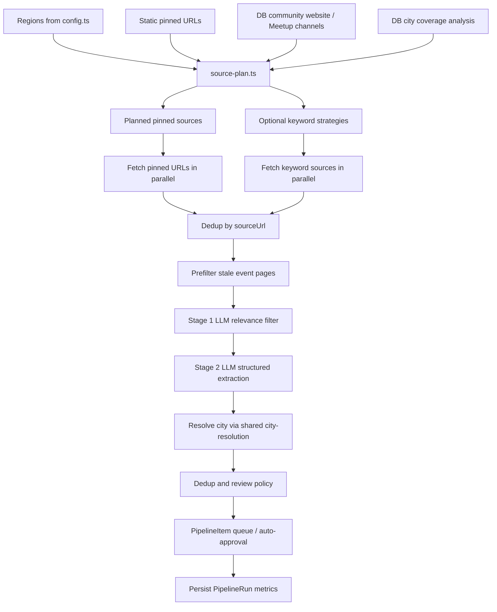

# IndLokal AI Content Agent - Technical Architecture

## Current Architecture Summary

The current pipeline is known-source-first.

It plans the fetch surface before doing network or LLM work, prioritizes DB-derived and curated pinned sources, filters stale event pages deterministically, and only widens into keyword search for low-coverage cities or explicit forced runs.

This is a deliberate shift away from the older generic-search-first architecture.

## Module Structure

```text
src/modules/pipeline/
├── config.ts         # Regions, fallback keyword seeds, static pinned URLs
├── db-sources.ts     # DB-derived pinned sources + event-page discovery/scoring
├── extraction.ts     # Two-stage LLM filter/extract with batching + timeout handling
├── index.ts          # Public exports
├── intelligence.ts   # Semantic duplicate checks + keyword suggestion intelligence
├── orchestrator.ts   # Executes plan: fetch → prefilter → filter → extract → resolve → dedup → queue
├── reliability.ts    # Source review statistics + confidence adjustments
├── review.ts         # Approval, auto-approval policy, entity creation/enrichment
├── run.ts            # CLI entrypoint
├── source-plan.ts    # Source planning: DB gaps, source caps, API gating, keyword fallback
├── sources.ts        # Fetch adapters for pinned URLs and keyword sources
├── text.ts           # Text helpers used by fetch/extraction pipeline
├── types.ts          # Pipeline types and run metrics
└── __tests__/
    ├── orchestrator.test.ts
    └── source-plan.test.ts

src/lib/
├── city-resolution.ts     # Shared city normalization + alias-aware matching
└── config/cities.ts       # Seeded city source of truth + city alias map

src/app/admin/(dashboard)/pipeline/
├── actions.ts             # Run, approve, reject, enrichment, keyword actions
├── page.tsx               # Pipeline queue page
└── RunPipelineButton.tsx  # On-demand pipeline trigger + summary UI
```

## Runtime Flow



## Core Design Decisions

### 1. Known-source-first planning

`source-plan.ts` is now the planning brain.

It decides:

- which pinned sources always run
- which DB-derived community sources are included
- whether keyword search should run at all
- whether credentials are available for Eventbrite / Google CSE
- whether DuckDuckGo is enabled
- how many DB-pinned sources are allowed under runtime caps

This keeps planning policy out of `orchestrator.ts`.

### 2. Keyword search is fallback, not default

Keyword search only runs when one of these is true:

- a region contains **low-coverage DB city gaps**
- `PIPELINE_FORCE_KEYWORD_SEARCH=1`

The low-coverage test is currently based on DB community counts per covered city and uses env-tunable thresholds and limits.

### 3. DB-derived pinned sources are prioritized

`db-sources.ts` now discovers event-looking sub-pages from community websites and scores them so that likely live pages rank above stale ones.

Signals that increase priority:

- `events`, `calendar`, `upcoming`, `termin`, `schedule`
- current-year or future-year references

Signals that reduce priority:

- `past`, `archive`, `gallery`, `review`, `recap`
- old-year-only pages

This matters because `PIPELINE_DB_PINNED_LIMIT` can cap the fetch surface. The best event pages should survive the cap first.

### 4. Deterministic stale-page prefilter before LLM

`orchestrator.ts` now removes likely stale event pages before the LLM filter stage.

That prefilter combines:

- stale-path markers
- event-page markers
- year signals
- `scorePinnedEventUrl()` from `db-sources.ts`

This saves LLM time and tokens on archive pages that were previously consuming extraction budget.

### 5. Two-stage LLM remains, but with tighter operational controls

`extraction.ts` still uses a two-stage design:

- **Stage 1**: cheap relevance filter
- **Stage 2**: structured extraction

Current operational details:

- filter batch size defaults to `10`
- extraction batch size defaults to `3`
- OpenAI requests use JSON mode
- extraction calls use a higher timeout than filter calls
- extraction failures trigger recursive batch splitting instead of failing the whole run
- LLM calls track approximate token usage and call counts

### 6. Shared city resolution

City matching is no longer pipeline-local string handling.

It now uses:

- `src/lib/city-resolution.ts`
- `src/lib/config/cities.ts`

The resolver currently supports:

- exact DB city name matches
- normalized slug/name matches
- configured aliases for true alternate names such as `München` and `Frankfurt am Main`

This is intentionally narrower than a fuzzy geographic resolver.

### 7. Review policy is not purely manual anymore

The queue is still the primary review surface, but `review.ts` can auto-approve items when all of the following are true:

- the source has enough review history
- source approval rate is high enough
- the extracted item confidence is at least `0.9`
- the item has the required core fields
- no duplicate or matched entity is already present

This uses source-level reliability stats from `reliability.ts`.

## Source Planning (`source-plan.ts`)

### Inputs

- enabled regions from `config.ts`
- static pinned URLs from `config.ts`
- DB community strategies from `db-sources.ts`
- approved dynamic keywords from `intelligence.ts`
- runtime env vars

### Outputs

`buildPipelineSourcePlan()` returns:

- keyword strategies to run
- pinned strategies to run
- static pinned count
- DB pinned count
- total DB pinned count before cap
- low-coverage city gap list
- operator notes describing what was skipped or capped

### Important runtime flags

- `PIPELINE_DB_PINNED_LIMIT`
- `PIPELINE_DB_GAP_CITY_THRESHOLD`
- `PIPELINE_DB_GAP_CITY_LIMIT`
- `PIPELINE_FORCE_KEYWORD_SEARCH`
- `PIPELINE_ENABLE_DDG`

## Regions and coverage (`config.ts`)

Current enabled regions:

- Baden-Württemberg
- Bavaria
- Hesse

Region city coverage is derived from seeded metro and satellite city data. The pipeline does not keep a separate city-coverage list by hand.

## Source adapters (`sources.ts`)

The current fetch layer supports:

- pinned URL fetches
- Eventbrite keyword search
- Google Custom Search keyword search
- DuckDuckGo keyword search

Important operational reality:

- Eventbrite runs only if `EVENTBRITE_API_KEY` is configured
- Google CSE runs only if `GOOGLE_CSE_API_KEY` and `GOOGLE_CSE_ID` are configured
- DuckDuckGo is implemented but disabled by default unless `PIPELINE_ENABLE_DDG=1`

## DB-driven source generation (`db-sources.ts`)

`getDbCommunityStrategies()` currently:

- includes communities with `ACTIVE`, `CLAIMED`, or `UNVERIFIED` status
- uses scrapeable `WEBSITE` and `MEETUP` channels
- always includes the homepage or Meetup events page
- crawls website homepages for likely event/calendar sub-pages
- attaches `hintCitySlug` from the owning community city

This is the self-improving discovery loop: approved communities create future fetch sources automatically.

## Orchestration (`orchestrator.ts`)

### Phase 1 - Fetch

- builds a source plan
- logs planning notes
- fetches pinned URLs in parallel
- fetches keyword strategies only when the plan includes them
- deduplicates by `sourceUrl`

### Phase 2 - Prefilter, Filter, Extract

- removes likely stale pages before LLM
- runs relevance filtering in batches
- runs structured extraction in batches
- captures stage timings for fetch, prefilter, filter, extract, and resolveQueue

### Phase 3 - Resolve, Dedup, Queue

- loads covered metros and satellites from the DB
- resolves extracted `cityName` via shared resolver and configured aliases
- falls back to `_hintCitySlug` from pinned strategies when needed
- skips past events
- merges into pending event pipeline items when an exact queued duplicate exists
- skips or flags duplicates using date/title similarity for events and semantic/name checks for communities
- applies source-confidence adjustments and review policy
- persists `PipelineRun` history

## Duplicate handling

Current duplicate handling layers:

1. exact `sourceUrl` match in pending or approved queue
2. event duplicate check using date window plus Dice similarity on titles
3. pending event merge when the same event already exists in the queue
4. community duplicate check using name similarity plus semantic review of borderline candidates

## Admin and trigger surfaces

The pipeline can currently be triggered by:

- `/admin/pipeline` via `RunPipelineButton`
- cron route at `/api/cron/pipeline`
- CLI via `pnpm --filter web pipeline`

The admin button returns a structured run summary to the UI.

The CLI supports:

- `--dry-run` for config preview
- `--strict` or `PIPELINE_STRICT=1` for non-zero exit on warnings/errors

## Community suggestions and submission bridge

Community suggestions do not rely on the fetch pipeline to enter the system.

User-facing suggestion flows create `PipelineItem` rows directly with `sourceType: COMMUNITY_SUGGESTION`, so the review queue can act on them even when no web source exists yet.

## Environment variables

Required:

- `OPENAI_API_KEY`
- `DATABASE_URL`

Optional fetch inputs:

- `EVENTBRITE_API_KEY`
- `GOOGLE_CSE_API_KEY`
- `GOOGLE_CSE_ID`

Optional runtime tuning:

- `PIPELINE_LLM_MODEL`
- `PIPELINE_LLM_TIMEOUT_MS`
- `PIPELINE_FILTER_BATCH_SIZE`
- `PIPELINE_EXTRACT_BATCH_SIZE`
- `PIPELINE_DB_PINNED_LIMIT`
- `PIPELINE_DB_GAP_CITY_THRESHOLD`
- `PIPELINE_DB_GAP_CITY_LIMIT`
- `PIPELINE_FORCE_KEYWORD_SEARCH`
- `PIPELINE_ENABLE_DDG`
- `PIPELINE_STRICT`

## Testing status to document accurately

Current focused tests cover more than the original docs described, including:

- source planning behavior
- stale-page prefilter behavior
- city resolution behavior
- duplicate similarity helper behavior

The older documentation that described the pipeline as primarily generic-search-first and always broadening via keywords is no longer accurate.

## Practical takeaway

The current system is not a generic all-Europe crawler with a thin config layer.

It is a staged, cost-controlled discovery pipeline that:

- starts from trusted known sources
- widens only when DB coverage is thin
- suppresses stale pages before AI cost is spent
- resolves cities through seeded city data
- keeps the admin queue as the main control surface

That is the implementation these docs should describe.
