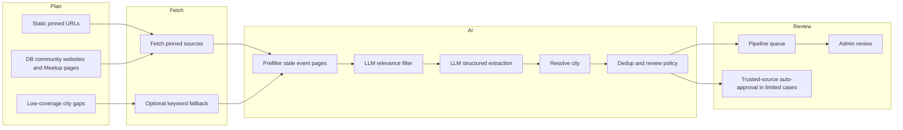

# IndLokal AI Content Agent - Product Document

## What It Is

The AI Content Agent is IndLokal's automated discovery and review pipeline for diaspora events and communities.

It does not operate as an open-ended web crawler. The current product is intentionally known-source-first:

- curated pinned pages are fetched every run
- community websites already in the database are fetched automatically
- broad keyword search is used only as a fallback for low-coverage cities, or when explicitly forced
- every discovered item goes into the pipeline review system, with optional auto-approval only for trusted high-confidence cases

This keeps the pipeline cheaper, faster, and less noisy than the earlier broad-search design.

## The Problem It Solves

Without the agent:

- admins have to keep revisiting community websites and city directories manually
- event pages go stale quickly, especially when organisations publish only to a calendar subpage
- newly approved communities do not automatically become future discovery sources
- low-coverage cities are easy to neglect because no one knows when discovery should widen beyond existing sources

With the agent:

- approved and seeded community websites become reusable discovery sources automatically
- pinned high-value sources are checked in minutes, not manually
- only low-coverage cities trigger broader fallback search
- results land in the admin queue with confidence, duplicate signals, and source provenance

## Current Operating Model

## How It Works

1. **Plan sources**
   The pipeline starts with curated pinned URLs and DB-derived community sources. It only adds keyword search when a region contains low-coverage cities or when keyword search is explicitly forced.

2. **Fetch known sources first**
   Static aggregators, official directories, and community websites are fetched in parallel. Community websites can also yield discovered event sub-pages such as calendar or upcoming-events URLs.

3. **Drop obviously stale event pages before AI**
   Pages that look like archives, galleries, past-event listings, or old-year schedules are filtered out before the LLM stages.

4. **Run a cheap relevance filter**
   A first LLM pass keeps likely diaspora-relevant items and drops obvious noise.

5. **Run structured extraction**
   A second LLM pass extracts event or community fields, including `cityName`, categories, access links, confidence, and field-level confidence.

6. **Resolve city and check duplicates**
   The extracted city name is matched against seeded DB cities, including normalized names and configured aliases. Exact URL matches, date-title similarity for events, and name similarity for communities are used to suppress duplicates.

7. **Queue or auto-approve**
   Most items land in `/admin/pipeline`. A small subset can be auto-approved when the source has strong historical approval rates and the extracted item is both high-confidence and complete.

## What It Discovers Today

### Events

- cultural and festival listings from community calendars
- upcoming programme pages and event sub-pages discovered from community websites
- public event-platform listings when fallback keyword search is enabled and configured
- city and umbrella-organisation listings that mention diaspora events

### Communities

- registered or publicly listed diaspora organisations
- community websites already in the DB that expose additional organiser or programme pages
- public mentions found through Google CSE or Eventbrite fallback where configured
- community suggestions submitted by users or ambassadors, which are added directly to the pipeline queue

## Source Channels

| Source                             | Current role              | Current behavior                                                                                                         |
| ---------------------------------- | ------------------------- | ------------------------------------------------------------------------------------------------------------------------ |
| **DB community websites / Meetup** | Primary discovery surface | Always used when scrapeable channels exist in the DB                                                                     |
| **Static pinned URLs**             | Primary discovery surface | Always used                                                                                                              |
| **Eventbrite**                     | Keyword fallback          | Only runs when low-coverage city gaps exist or forced, and only if `EVENTBRITE_API_KEY` is configured                    |
| **Google Custom Search**           | Keyword fallback          | Only runs when low-coverage city gaps exist or forced, and only if `GOOGLE_CSE_API_KEY` + `GOOGLE_CSE_ID` are configured |
| **DuckDuckGo**                     | Optional keyword fallback | Implemented, but disabled by default; enable with `PIPELINE_ENABLE_DDG=1`                                                |
| **User / ambassador suggestions**  | Direct queue seeding      | Creates pipeline items immediately; does not depend on web discovery                                                     |

## Current Coverage

The currently enabled search regions are:

- Baden-Württemberg
- Bavaria
- Hesse

City coverage inside those regions is derived from the seeded city and satellite-city config, not maintained separately inside the pipeline.

## Human Review Experience

The admin pipeline page at `/admin/pipeline` currently supports:

- on-demand runs via **Run Pipeline Now**
- run summaries including fetched, filtered, extracted, queued, duplicate, no-city, token, and error counts
- per-item approve and reject actions
- batch approve flows
- additional enrichment and keyword-suggestion review actions

The queue is still the main moderation surface. Auto-approval exists, but only for trusted-source, high-confidence items with enough structured fields.

## The WhatsApp-Only Problem

This is still a hard problem, and the current implementation is deliberately honest about it.

The agent helps in three practical ways:

1. **Suggestion bridge**
   User and ambassador submissions create `COMMUNITY_SUGGESTION` pipeline items immediately.

2. **Public mention discovery**
   When keyword fallback is active, Google CSE and optional DuckDuckGo can still pick up scattered public mentions.

3. **Self-improving website loop**
   Once a community is approved with a website or Meetup channel, that URL becomes a future discovery source automatically.

What it does **not** do today is magically discover truly private WhatsApp-only communities without any public footprint or user suggestion.

## Self-Improving Loop

The current pipeline improves itself through database feedback:

1. a community is approved or seeded with a scrapeable channel
2. that channel is picked up by `db-sources.ts`
3. the next pipeline run fetches it automatically
4. discovered event sub-pages from that site are added as higher-priority pinned sources

The database is therefore not just storage. It is an active source registry for future pipeline runs.

## Run Modes

The pipeline currently runs in three ways:

- **Admin-triggered** from `/admin/pipeline`
- **Cron-triggered** through the app route
- **CLI-triggered** with `pnpm --filter web pipeline`

The CLI is tolerant by default and only exits non-zero on warnings when run with `--strict` or `PIPELINE_STRICT=1`.

## Metrics Tracked Per Run

Each run records and/or returns:

- regions scanned
- sources processed
- items fetched
- items passed filter
- items extracted
- items queued
- duplicates skipped
- no-city skips
- past-event skips
- LLM calls and token estimate
- total duration
- per-stage timings
- source and fetch errors

## What Changed From The Earlier Vision

The current implementation is intentionally narrower than the earlier generic-search story:

- discovery is known-source-first, not broad-search-first
- keyword search is conditional, not always-on
- DuckDuckGo exists but is off by default
- stale event pages are filtered before AI cost is spent
- some items can be auto-approved based on review history and confidence

That is the correct current product shape for this stage.
