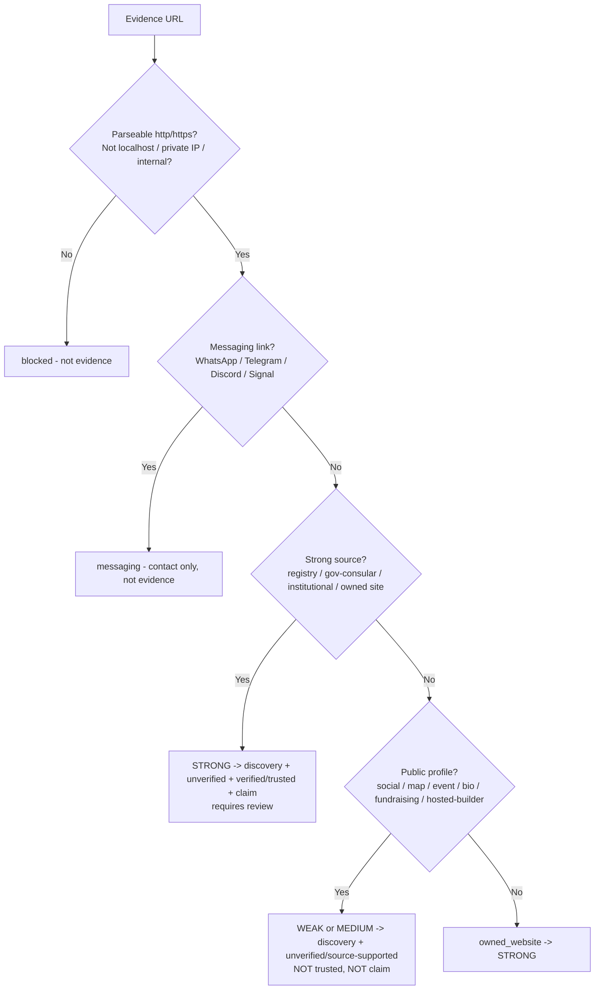

# Source & Evidence Policy: Trust Model for Listings (Product Blueprint)

## 1. Purpose and Scope

This document defines **what counts as evidence that a community or organisation is
real, how that evidence is classified, and what each class of evidence is allowed to
unlock** on IndLokal. It is the foundational product blueprint for the **trust layer** —
the moat that separates IndLokal from a scraped directory.

It covers:

- What "evidence" is and where it comes from
- The single guiding principle: **broad discovery + strict verification**
- The taxonomy of evidence (strong / medium / weak / not-evidence) and concrete examples
- The **five independent decisions** evidence drives, and why they must never be merged
- URL safety, hostname normalization, and German legal-entity trust signals
- Where the policy runs in the product today, and what is stored
- Who the actors are and how the policy affects each of them
- Where today's product matches this blueprint and where it does not yet

It does **not** prescribe database column types or migration mechanics. The canonical
implementation lives in [apps/web/src/lib/source-policy.ts](../apps/web/src/lib/source-policy.ts);
this is the product operating blueprint behind it. For the authority model that decides
_who_ may act, see [RBAC_AND_AUTHORIZATION.md](./RBAC_AND_AUTHORIZATION.md). For the listing
lifecycle this trust layer feeds, see [COMMUNITY_CLAIM_FLOW.md](./COMMUNITY_CLAIM_FLOW.md)
and [COMMUNITY_SUBMISSION_FLOW.md](./COMMUNITY_SUBMISSION_FLOW.md). The directly analogous
two-axis model for events is [EVENTS_AND_LIFECYCLE.md](./EVENTS_AND_LIFECYCLE.md).

---

## 2. Why This Blueprint Exists

IndLokal lists Indian / diaspora communities and organisations across Germany. The
**supply problem** is brutal: most real communities have only weak public footprints — a
Facebook page, an Instagram handle, a Meetup group, a pin on Google Maps. A naïve policy
makes one of two opposite mistakes:

1. **Too strict** — reject everything without an owned website or a German register
   entry, and the directory is empty. Real communities never get discovered.
2. **Too loose** — treat a Facebook page as proof, and every listing looks "verified."
   Trust becomes meaningless, and the moat is gone the moment a generative-AI answer
   engine scrapes the same Facebook pages.

The resolution is to stop treating "is this real?" as one yes/no question. A weak source
is _enough to discover_ a community but _not enough to vouch for it_. The policy's job is
to **classify evidence correctly and keep the consequences separate** — so a thinly
documented community can still be found, while the "verified/trusted" label keeps meaning
exactly what it says.

The single most important idea: **evidence strength and listing trust are a spectrum, not
a gate.** Conflating "can we list this?" with "do we vouch for this?" is the defect this
blueprint prevents.

---

## 3. Core Principle: Broad Discovery + Strict Verification

> **We are generous about discovery and strict about trust.**

- **Discovery is generous.** Almost any _public_ source — social profile, map listing,
  event page, link-in-bio — is enough to create and publish a listing so people can find
  the community.
- **Trust is earned.** Only **strong** evidence (an owned website, an official register,
  a government/consular page, a recognised institutional directory) — usually combined
  with **manual review** — can elevate a listing to _verified/trusted_ or back an
  organiser's claim.
- **Private channels are not evidence at all.** A WhatsApp or Telegram link is contact
  info, not proof of existence.

Everything below is the disciplined expression of this one sentence.

---

## 4. The Five Decisions (the heart of the policy)

A piece of evidence is never just "valid" or "invalid." It answers up to **five separate
questions**, and a source can answer _yes_ to the early ones while answering _no_ to the
later ones.

| #   | Decision                       | Plain-language question                                               | Minimum evidence               |
| --- | ------------------------------ | --------------------------------------------------------------------- | ------------------------------ |
| 1   | **Create draft**               | May we create a listing/draft at all?                                 | Any usable public source       |
| 2   | **Publish unverified**         | May an _unverified / source-supported_ listing go live for discovery? | Any usable public source       |
| 3   | **Mark source-supported**      | May we say "we found this on a public source"?                        | Any usable public source       |
| 4   | **Mark verified / trusted**    | May we vouch for this listing?                                        | **Strong** evidence (+ review) |
| 5   | **Support claim verification** | May this evidence back an organiser/admin _claim_?                    | **Strong** evidence (+ review) |

Decisions 1–3 ride on the same low bar (_any public evidence_). Decisions 4–5 require the
high bar (_strong evidence_). The whole point is that a Facebook-only community clears
1–3 and is **discoverable**, but fails 4–5 and is **never shown as trusted** until
something stronger arrives.

---

## 5. The Evidence Taxonomy

Every URL is classified into a granular **tier**, rolled up into a coarse **strength**,
and given a deterministic **confidence** (0–100) used only to sort/label in admin tools.

### 5.1 Strong evidence — _can support trust, usually with review_

| Tier                      | Confidence | Examples                                                            | Why strong                               |
| ------------------------- | :--------: | ------------------------------------------------------------------- | ---------------------------------------- |
| `official_registry`       |    100     | Handelsregister, Vereinsregister, Unternehmensregister              | A legal entity is on the public record   |
| `government_consular`     |     90     | stuttgart.de, muenchen.de, `*.gov.in`, cgimunich.gov.in, mea.gov.in | A government/consular body lists it      |
| `institutional_directory` |     80     | Forum der Kulturen, aigev.org, indoeuropean.eu                      | A trusted umbrella body vouches for it   |
| `owned_website`           |     70     | An organisation's own custom domain                                 | The org controls its own public presence |

> `owned_website` is the only strong tier that is safe to _auto-accept without review_;
> registry / government / institutional pages still flag `requiresReview` because the page
> may list many entities and a human should confirm the match.

### 5.2 Medium evidence — _reviewable, not trusted on its own_

| Tier                  | Confidence | Examples                                                  | Note                                                                       |
| --------------------- | :--------: | --------------------------------------------------------- | -------------------------------------------------------------------------- |
| `hosted_site_builder` |     50     | Google Sites, Wix, Weebly, Jimdo, WordPress.com, Blogspot | Looks like a website but anyone can spin one up; needs review before trust |

### 5.3 Weak but useful evidence — _helps discovery, never trust_

| Tier             | Examples                                                                      |
| ---------------- | ----------------------------------------------------------------------------- |
| `social_profile` | Facebook, Instagram, LinkedIn, YouTube, X/Twitter, Threads, TikTok, Pinterest |
| `map_listing`    | Google Maps, Yelp, OpenStreetMap                                              |
| `event_platform` | Meetup, Eventbrite, Allevents, RA, Dice, Billetto                             |
| `bio_link`       | Linktree, Beacons, Carrd, about.me, Taplink                                   |
| `fundraising`    | GoFundMe, betterplace, Patreon, Ko-fi, Kickstarter                            |
| `document_link`  | Google Docs / Drive / Forms and other shared documents                        |

All weak tiers: `supportsDiscovery = true`, `supportsUnverifiedListing = true`,
`supportsVerifiedTrust = false`, `supportsClaimVerification = false`, `requiresReview = true`.

### 5.4 Not public evidence

| Tier        | Examples                                                                                                                   | Treatment                                                                  |
| ----------- | -------------------------------------------------------------------------------------------------------------------------- | -------------------------------------------------------------------------- |
| `messaging` | WhatsApp (wa.me, chat.whatsapp.com), Telegram (t.me), Discord invites, Signal, Messenger (m.me)                            | May be stored as a **contact channel / admin note**, but unlocks _nothing_ |
| `blocked`   | Invalid URL, non-http(s) scheme, localhost, private/loopback/link-local IPs, raw IP addresses, internal/single-label hosts | Rejected outright                                                          |

---

## 6. URL Safety & Normalization

Before classification, every input is normalized and safety-checked. This is both a
correctness and a **security** measure (it prevents SSRF-style internal targets and
spoofed hosts from ever counting as organisation evidence).

- **Protocol-optional input.** `hssgermany.org/about` is accepted and normalized to
  `https://hssgermany.org/about`. Only `http`/`https` survive; `ftp:`, `javascript:`,
  `mailto:`, etc. are `blocked`.
- **Hostname normalization.** Lowercased, trailing dot stripped, leading `www.` removed,
  so `https://WWW.Example.ORG./` → host `example.org`.
- **Internal / private targets blocked.** `localhost`, single-label hosts (`intranet`),
  reserved suffixes (`.local`, `.internal`, `.lan`, …), private/loopback/link-local IPv4
  ranges (`10.x`, `192.168.x`, `127.x`, `169.254.x`, `172.16–31.x`), and **any raw IP
  address** used as organisation evidence are all rejected.
- **No broad domain rules.** Google products are classified _individually_ — Maps →
  `map_listing`, Sites → `hosted_site_builder`, Docs/Drive/Forms → `document_link` — so a
  blanket "google.com" rule can never misclassify an unrelated page.

Each assessment returns the `normalizedUrl` and `hostname` so downstream UIs and audit
logs store a consistent, canonical value.

---

## 7. German Legal-Entity Trust Signals

German diaspora organisations are very often registered associations. A legal-form marker
in a name or impressum (`e.V.`, `gGmbH`, `UG`, …) is a **supporting** trust signal — it
strengthens the case for review, but it does **not** replace a qualifying evidence URL.

Matching is deliberately **boundary-aware and umlaut-normalized** to avoid the classic
false positives:

- Umlauts are folded first: `ä→ae`, `ö→oe`, `ü→ue`, `ß→ss`.
- Markers must stand as whole tokens, so the dangerous bare `ev` substring **never**
  matches inside `event`, `seva`, or `development`. The `e.V.` form specifically requires
  its period.
- Recognised markers: `e.V.` / `e. V.`, `eingetragener Verein`, `Verein`, `UG`, `gUG`,
  `GmbH`, `gGmbH`, `KG`, `eG`.

`detectGermanLegalEntityMarkers()` returns _which_ markers matched, so an admin can see
"this name asserts an `e.V.`" as a reviewable signal.

---

## 8. Trust Summary & Scoring

For a _set_ of URLs (a listing usually has several channels), `summarizeEvidence()`
produces a single deterministic readout for product and admin surfaces:

- **`quality`** — one of:
  - `verified_candidate` — at least one strong source; eligible for trusted status after review.
  - `source_supported` — only weak/medium public sources; listable and discoverable, not trusted.
  - `insufficient` — no usable public evidence (e.g. messaging-only); cannot even create a draft.
- **`score`** — the highest confidence among the URLs (for sort/badge ordering only).
- **`strongest`** — the single best assessment.
- Capability roll-ups: `canCreateDraft`, `canPublishUnverified`, `canMarkSourceSupported`,
  `canMarkVerifiedTrusted`, `canSupportClaimVerification`, `requiresReview`.
- **`reviewReason`** — a human-readable sentence for the admin queue, e.g. _"Only weak
  public sources (Social profile). Can be listed as source-supported/unverified; strong
  evidence or manual review is required before trusted status or claim verification."_

> The score **never overrules** the policy. It exists to help admins sort and display
> evidence quality, not to auto-promote a listing.

---

## 9. Where the Policy Runs Today (implementation map)

This is the honest, current state — not an aspiration.

| Surface                     | File                                                                                                  | What the policy does                                                                                                                                                            | On weak/failed evidence                    |
| --------------------------- | ----------------------------------------------------------------------------------------------------- | ------------------------------------------------------------------------------------------------------------------------------------------------------------------------------- | ------------------------------------------ |
| **Directory seed**          | [apps/web/prisma/directory.ts](../apps/web/prisma/directory.ts)                                       | Each curated entry's `sourceUrl` is assessed; the row is created only if it qualifies, and `metadata.sourceEvidence = {tier, label, requiresReview}` + `needsReview` are stored | Entry is **skipped** with a warning        |
| **Resources seed**          | [apps/web/prisma/resources.ts](../apps/web/prisma/resources.ts)                                       | A resource is created only if it has ≥1 **qualifying** (strong) evidence URL; stores `metadata.sourceEvidence[]`                                                                | Resource is **skipped** (`skippedInvalid`) |
| **Pipeline pinned sources** | [apps/web/src/modules/pipeline/runtime-config.ts](../apps/web/src/modules/pipeline/runtime-config.ts) | DB-configured pinned URLs are only added to the extraction plan when `isQualifying`                                                                                             | Pinned URL is **disabled** with a warning  |

In all three places the gate uses the **legacy `isQualifying` flag**, which is preserved
to mean exactly "strong, trust-supporting evidence." That keeps current behaviour
identical while the richer model (tiers, strength, the five decisions) is available for
new surfaces.

### 9.1 The seed editorial policy this encodes

The directory seed's "Tier A / B / C" editorial rules
([docs/deployment/ADMIN_AND_BOOTSTRAP.md §7](./deployment/ADMIN_AND_BOOTSTRAP.md)) are the
human-facing version of `isQualifying`: Tier A (owned site), Tier B (German registry),
Tier C (institutional/government) are acceptable sole sources; Facebook / Instagram /
WhatsApp / Maps alone are not. The code and the editorial doc agree by construction.

---

## 10. Data & Model Alignment (conceptual)

The policy writes and reads through existing fields — **no new tables are required**.

- **`Community.metadata.sourceEvidence`** — `{tier, label, requiresReview}`, written by the
  directory seed. The evidence provenance of a seeded listing.
- **`Resource.metadata.sourceEvidence[]`** — array of `{url, tier, label, requiresReview}`.
- **`Community.status`** (`ACTIVE` / `INACTIVE` / `UNVERIFIED`) — listing lifecycle; new
  and weakly-sourced listings sit at `UNVERIFIED`.
- **`Community.claimState`** (`UNCLAIMED` / `CLAIM_PENDING` / `CLAIMED`) — ownership axis,
  _orthogonal_ to evidence (a claimed listing still has an evidence tier).
- **`Community.trustScore`** + **`TrustSignal[]`** (`ADMIN_VERIFIED`, `COMMUNITY_CLAIMED`,
  `EDITORIAL_REVIEWED`, `USER_REPORTED_ACCURATE`, `USER_REPORTED_STALE`) — the accumulated
  trust record. Strong evidence + review is what justifies writing an `ADMIN_VERIFIED` or
  `EDITORIAL_REVIEWED` signal.

> Evidence strength, listing status, and claim state are **three orthogonal axes**, exactly
> as moderation and lifecycle are orthogonal for events. A listing can be
> `UNVERIFIED` + `UNCLAIMED` + `source_supported` (typical seed), or `ACTIVE` + `CLAIMED` +
> `verified_candidate` (a claimed org with an owned website).

---

## 11. Who the Users Are & How This Affects Them

| Actor                              | What the policy means for them                                                                                                                          |
| ---------------------------------- | ------------------------------------------------------------------------------------------------------------------------------------------------------- |
| **Newcomer / member (end user)**   | Can discover thinly-documented communities that a strict directory would hide — while a _verified_ label, when shown, genuinely means vouched-for.      |
| **Community organiser (claimant)** | Their public website / register entry is what lets them pass _claim verification_. A WhatsApp link alone will not.                                      |
| **Editor seeding the directory**   | Must attach a qualifying source per entry; the seed refuses weak-only rows, keeping day-one content trustworthy.                                        |
| **Platform admin / ops reviewer**  | Reads `quality`, `score`, and `reviewReason` to triage the queue and decide trust elevation; writes the `ADMIN_VERIFIED` / `EDITORIAL_REVIEWED` signal. |
| **Content pipeline**               | Only strong-evidence URLs get pinned for focused extraction; weak sources still inform discovery but never masquerade as authoritative.                 |

---

## 12. Current State vs. Intended (the honest gap)

Like [EVENTS_AUDIT.md](./EVENTS_AUDIT.md) does for events, this section records where the
build does not yet meet the blueprint.

**Adoption status (PRD/TDD-0055 — Implemented):** the four runway items below are now wired.
See [`docs/specs/PRD/0055-evidence-trust-layer-adoption.md`](./specs/PRD/0055-evidence-trust-layer-adoption.md).

1. **Evidence is surfaced.** A small, honest badge driven by `summarizeEvidence()` is now
   rendered publicly: a positive "Strong source" chip on `CommunityCard` and a "Strong
   source" / "Source-supported" line on the community detail page. It derives at read time
   from public access-channel URLs and exposes **no PII**. The word "Verified" is deliberately
   never used for a source — it is reserved for the organization/claim axis (§17). (Helper:
   `lib/community-trust.ts`.)
2. **Submission flow classifies at intake.** Both the web server action (`submitCommunity`)
   and the mobile pipeline service (`createCommunitySubmission`) run `summarizeEvidence()` on
   submitted channels and persist a compact `sourceEvidence` summary (+ `needsReview`) so the
   admin queue is pre-graded. The admin submissions queue renders that quality as a chip.
3. **Claim proof is pre-flagged.** The admin claims queue runs `summarizeEvidence()` /
   `canSupportClaimVerification()` over the claim's evidence links and shows whether the proof
   can back a claim before a human looks.
4. **Still only `isQualifying` at ingestion.** The richer five-decision API is now consumed in
   the surfaces above via `summarizeEvidence()`; the ingestion seeds/pipeline still gate on the
   legacy `isQualifying`. Migrating those remaining call sites is additive and back-compatible.

None of these were regressions — they were the **adoption runway** the new model opened up, now
largely closed (no schema migration; metadata + read-time derivation only).

---

## 13. Governance Rules

1. **Discovery never implies trust.** A listing being visible says nothing about whether it
   is verified. The two are separate fields and separate badges.
2. **Strong evidence + review, never strong evidence alone, elevates trust.** Even an owned
   website is reviewed before an `ADMIN_VERIFIED` signal is written (the auto path only
   skips review for _seed creation_, not for trust elevation).
3. **Messaging links are quarantined.** They may be stored as contact info, but they can
   never create, publish, or verify a listing.
4. **Every elevation is recorded.** Trust changes are `TrustSignal` rows with who/when/why.
5. **The policy is deterministic.** Same inputs → same classification, every time. No model
   calls, no randomness, fully unit-testable.
6. **Domain lists are data, not logic.** Trusted/weak/blocked host lists are grouped so they
   can move to config or a DB table without touching the classification rules.

---

## 14. Public API Surface (function reference)

All exported from [apps/web/src/lib/source-policy.ts](../apps/web/src/lib/source-policy.ts):

**Single URL**

- `assessEvidenceUrl(url) → EvidenceAssessment` — the full classification of one URL.

**Multiple URLs**

- `assessEvidenceUrls(urls)` — classify each.
- `hasUsablePublicEvidence(urls)` — any public (discovery-capable) source?
- `getTrustSupportingEvidence(urls)` — only strong assessments.
- `getProfileSupportingEvidence(urls)` — weak/medium (discovery-only) assessments.

**Workflow decisions**

- `canCreateDraft`, `canPublishUnverified`, `canMarkSourceSupported`,
  `canMarkVerifiedTrusted`, `canSupportClaimVerification`.

**Summary & review**

- `summarizeEvidence(urls) → EvidenceSummary` — quality, score, capability roll-ups.
- `getEvidenceReviewReason(urls)` — one-line admin reason.

**German markers**

- `hasGermanLegalEntityMarker(text)`, `detectGermanLegalEntityMarkers(text)`.

**Legacy (preserved, = strong evidence)**

- `hasQualifyingEvidence(urls)`, `getQualifyingEvidence(urls)`, `isQualifying` on each
  assessment.

Representative behaviour is locked by
[apps/web/src/lib/\_\_tests\_\_/source-policy.test.ts](../apps/web/src/lib/__tests__/source-policy.test.ts).

---

## 15. Non-Goals (this blueprint)

- Crawling or fetching the evidence URL to confirm it resolves (classification is by
  host/shape only; live-fetch verification is a future review aid).
- Scoring _content quality_ of a page (we score _source type_, not prose).
- Replacing human review for trust elevation — the policy _gates and triages_, it does not
  auto-promote.
- A separate evidence table or migration — the model rides on existing `metadata`,
  `status`, `claimState`, `trustScore`, and `TrustSignal`.

---

## 16. Future Direction

The original runway items (honest quality badge, intake grading, claim pre-flagging) are now
shipped — see §12 and PRD/TDD-0055. What remains open:

- **Move host lists to config/DB** so trusted domains can be curated without a deploy.
- **Optional live-resolve check** during review to upgrade `hosted_site_builder` / Google
  pages once a human confirms they load and match.
- **Business-entity extension** — reuse the same tiers for the future business/ecosystem
  graph, where registry evidence carries even more weight.
- **Retire the legacy `isQualifying` gate** at ingestion seeds/pipeline in favour of the
  full `summarizeEvidence()` API already used on read surfaces (additive, back-compatible).

---

## 17. Presentation Coherence Contract (canonical vocabulary)

To prevent drift between product surfaces, the trust layer now requires a shared
**policy-to-presentation contract** in code (`apps/web/src/lib/community-trust.ts`).

### 17.1 Why this is required

Evidence classification can be deterministic while UX still becomes inconsistent if each
surface re-implements labels, severity, or priority order. This causes conflicting trust
signals for the same community. Worst of all, drift let the same evidence state be called
three different things ("Verified source" / "Strong" / "Strong evidence"), and "Verified"
structurally collided with the honesty rule that source quality must never imply that the
_organization_ is verified.

### 17.2 Canonical evidence vocabulary (one ladder, everywhere)

The word **"Verified" is reserved for the organization/claim axis** (an admin/owner action).
Evidence quality only ever describes **source strength**, on this single ladder. Every surface
reads these exact words from `EVIDENCE_QUALITY_DESCRIPTORS` in `community-trust.ts` — the doc
and the code agree by construction.

| Policy quality (`source-policy.ts`) | Short chip   | Standard label / public badge | Badge kind         | Tone         |
| ----------------------------------- | ------------ | ----------------------------- | ------------------ | ------------ |
| `verified_candidate`                | Strong       | Strong source                 | `strong_source`    | strong       |
| `source_supported`                  | Source       | Source-supported              | `source_supported` | supported    |
| `insufficient`                      | Insufficient | Insufficient evidence         | _(no badge)_       | insufficient |

Note: `verified_candidate` is an internal policy enum meaning "a candidate strong enough to be
_considered_ for verification" — it is **never** surfaced with the word "Verified." Its public
vocabulary is always "Strong source."

### 17.3 Contract responsibilities

- **Evidence quality mapping** — one descriptor map (`EVIDENCE_QUALITY_DESCRIPTORS`) owns
  every label, short label, tone, and tooltip description; `getEvidenceQualityDisplay()` and
  `badgeFromSummary()` both delegate to it.
- **Stored-vs-live resolution**:
  - Prefer persisted `metadata.sourceEvidence` when available.
  - Fall back to `summarizeEvidence(urls)` for legacy/incomplete rows.
- **Claim proof readout**:
  - Strong proof can back claim verification.
  - Weak public proof requires manual review.
  - Messaging/blocked-only proof is insufficient.
- **Community card marker priority** (capped chips):
  - `CLAIMED` ownership first,
  - then strong source,
  - then provisional,
  - then trending,
  - pulse only as fallback.

### 17.4 Invariants

1. Ownership, evidence, and lifecycle remain orthogonal axes.
2. Ownership (`CLAIMED`) is the strongest public trust signal and must not be displaced
   by lower-priority markers when chip count is capped.
3. Evidence labels describe source quality only and must never imply org verification —
   enforced by a unit test asserting no evidence label contains the word "Verified."
4. Any quality-label or tone change happens in one descriptor map and automatically
   propagates to admin and public surfaces.
